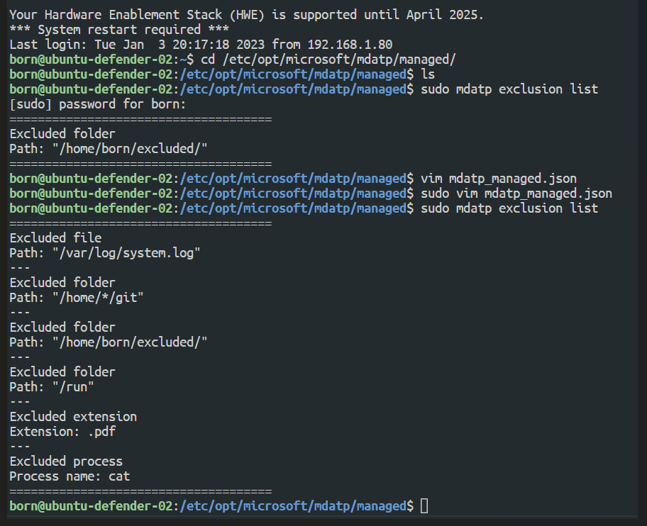
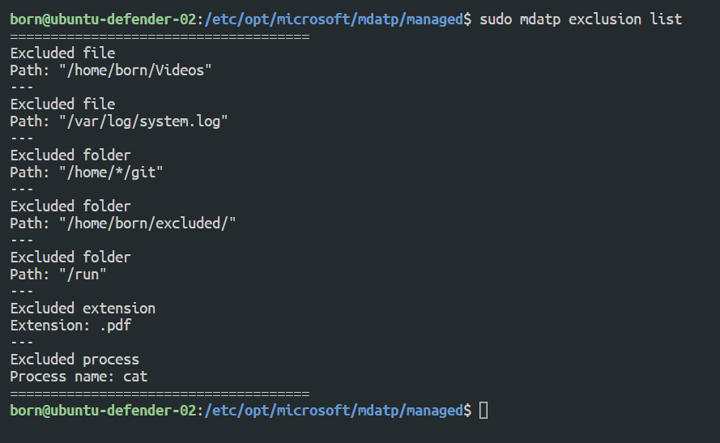

## Tests 

1. Definition by "hand" versus "mdatp_managed.json" update
2. The "mdatp_managed.json" update versus definition by "hand"
3. Path mdatp_manageed.json /etc/opt/microsoft/mdatp/managed/


## Test 1
Results:
```text
sudo mdatp exclusion list
```


## Test 2 
Results:
```text

```


## Test 4
When the file is updated the mdatp renew the definition automatically. 
What was added before does not change.